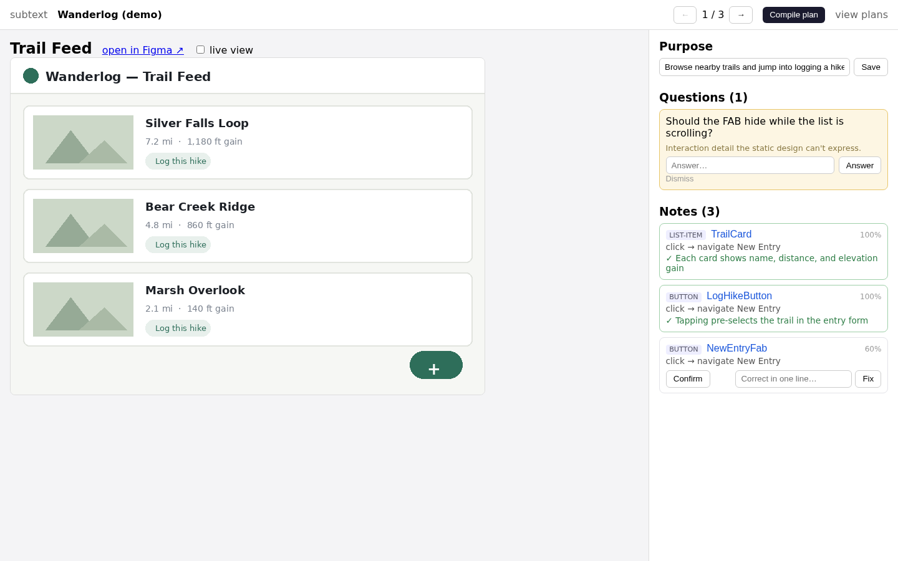
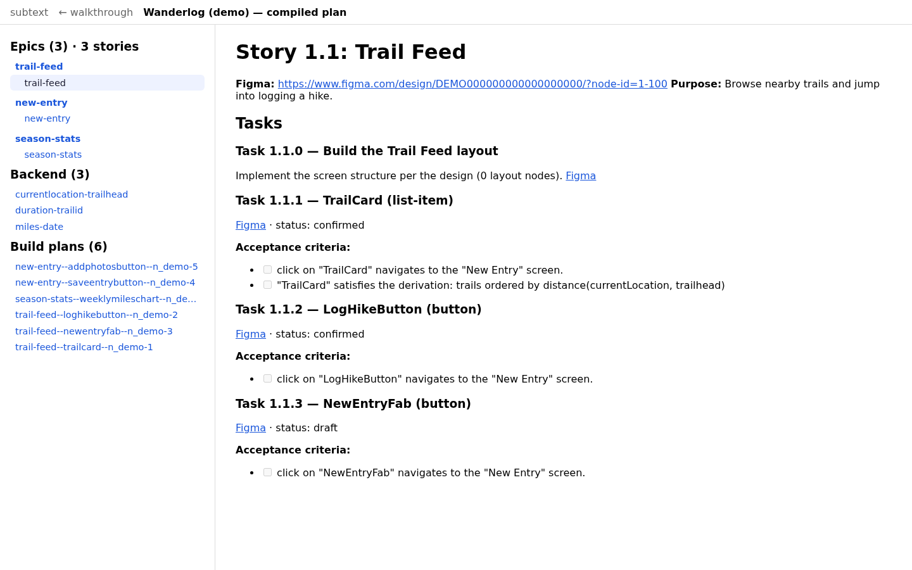

# subtext

*What the design can't say.*

The intent-capture layer between a Figma design and code-generating agents: pull down the design, work out what goes to what, capture the behavior and business rules the design is silent about, and compile epics/stories/tasks plus per-task AI build plans.


*The walkthrough: the design on one side; inferred purpose, notes, and clarifying questions with confirm/correct controls on the other.*


*Compile plan: epics/stories, extracted backend rules, and agent-ready build plans — acceptance criteria are always derived from captured intent, never authored.*

Full spec: [BRIEF.md](./BRIEF.md). Read its Non-goals and Operating principles before writing code.

## Run

```sh
cp .env.example .env   # add your Figma personal access token
npm install
npm run dev
```

Paste a Figma file link on the home page → the pipeline ingests every screen, seeds the intent graph, and flags clarifying questions → walk the design screen by screen, confirming/correcting the AI's notes and answering questions → **Compile plan** emits epics/tasks and per-task build plans as markdown under `data/projects/<id>/plans/`.

## Layout

- `src/lib/schema.ts` — the intent graph types (the load-bearing model, BRIEF §5)
- `src/lib/server/figma.ts` — design ingest via Figma REST API
- `src/lib/server/triage.ts` — heuristics that turn ambiguity into `ClarifyingQuestion`s (AI pass slots in here)
- `src/lib/server/compile.ts` — projections: derived acceptance criteria, PM plan, agent build plans
- `src/lib/server/store.ts` — JSON graph store (shaped for a later Postgres swap)
- `src/routes/walkthrough/[project]` — the screen-by-screen review surface

## Status

MVP slice under construction — deterministic ingest/triage/compile work end-to-end; the AI triage pass (Agent SDK), knowledge-source intake, and the fidelity overlay are next. See BRIEF §11 for the build sequence.
